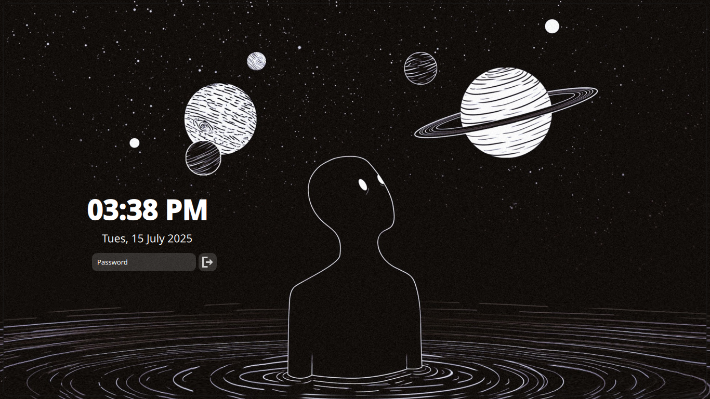
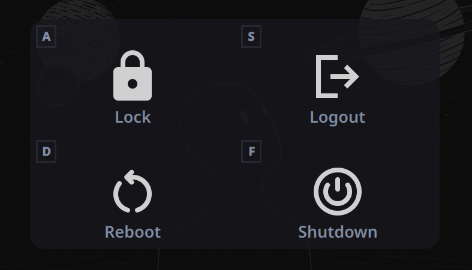
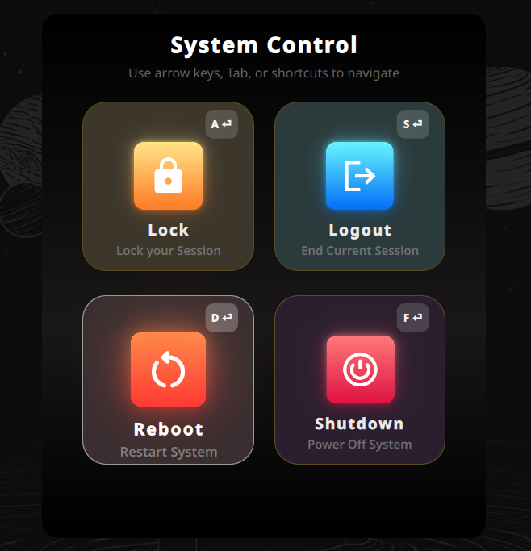
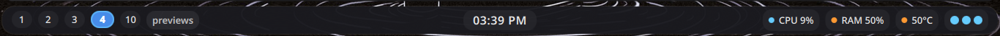

# freax.components

## Previews 





---
current structure

```bash
├── status_bar
│   ├── shell.qml
│   └── assets
│       └── logo.png
├── app launcher
│   ├── shell.qml
│   └── assets
│       └── logo.png
│
└── README.md
```

